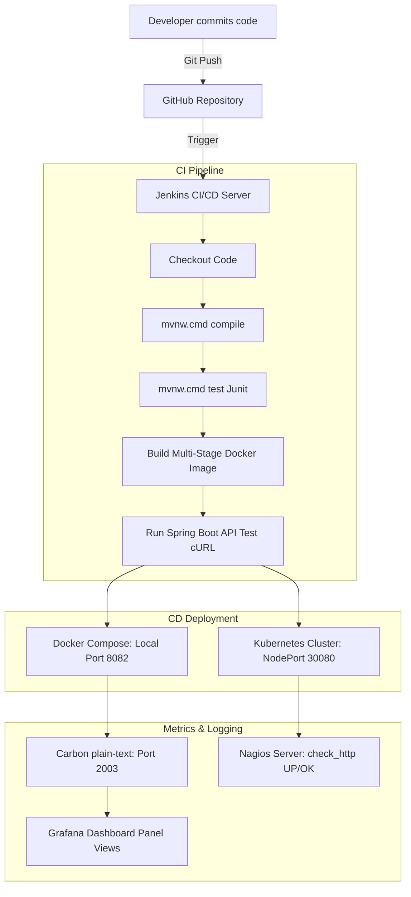

# DevOps Assignment 2 | Use Case 2: Task Manager Web Application
**Application Name:** TaskManager Dashboard  
**Course:** DevOps (Assignment-2)  
**Student Name:** Mayank Joshi  
**Register Number:** 24BCE10858  

---

## 1. Mandatory Submission Links

| Sl. No. | Submission Item | Description | Link / Status |
|---|---|---|---|
| **1** | **GitHub Repository Link** | Link to the complete source code repository. | `https://github.com/Mayank251125/24BCE10858-DevOps-Project` |
| **2** | **Jenkins Build URL** *(if accessible)* | URL of successful Jenkins job or pipeline console output. | `http://localhost:8080/job/vit-techfest-pipeline/` (Screenshots in `/screenshots/jenkins/`) |
| **3** | **Docker Hub Link** *(Optional)* | Repository link if image is pushed to Docker Hub. | `https://hub.docker.com/r/Mayank251125/vit-techfest-app` |
| **4** | **Application URL** | Deployed application URL (local port or cloud load balancer IP). | Local (JVM): `http://localhost:8081` / Local (Docker): `http://localhost:8082` / K8s: `http://localhost:30080` |
| **5** | **Grafana Dashboard Screenshot** | Screenshot showing system performance and metrics panels. | Saved in `screenshots/grafana_dashboard.png` |
| **6** | **Nagios Monitoring Screenshot** | Screenshot showing host state UP and HTTP service state OK. | Saved in `screenshots/nagios_status.png` |
| **7** | **Graphite Metrics Screenshot** | Screenshot showing system/network metrics received in Graphite. | Saved in `screenshots/graphite_metrics.png` |

---

## 2. Restructured Directory Layout

The application has been restructured into a Spring Boot MVC and CRUD Task Manager Java application compiled using **Maven Wrapper** and connected to a Graphite server:

```text
24BCE10858_Mayank_Joshi_DevOps_Project/
├── pom.xml                 # Maven configuration descriptor (managing dependencies & package packaging)
├── mvnw                    # POSIX standard Maven wrapper shell script
├── mvnw.cmd                # Windows standard Maven wrapper execution script
│
├── .mvn/
│   └── wrapper/
│       └── maven-wrapper.properties # Configures Maven distribution binaries (v3.9.5)
│
├── src/
│   ├── main/
│   │   ├── java/
│   │   │   └── com/example/taskmanager/
│   │   │       ├── TaskmanagerApplication.java # Spring Boot main startup class
│   │   │       ├── config/
│   │   │       │   └── GraphiteConfiguration.java # Telemetry Graphite connection class
│   │   │       ├── controller/
│   │   │       │   └── TaskController.java        # RestController CRUD mappings
│   │   │       ├── model/
│   │   │       │   └── Task.java                  # Task data POJO model
│   │   │       └── service/
│   │   │           └── TaskService.java           # Thread-safe Task logic handler
│   │   │
│   │   └── resources/
│   │       ├── application.properties             # Spring configuration attributes
│   │       └── static/                            # Web App Frontend Assets
│   │           ├── index.html                     # Task Manager board webpage
│   │           ├── css/
│   │           │   └── style.css                  # UI Slate stylesheet
│   │           └── js/
│   │               └── script.js                  # Asynchronous CRUD REST operations
│   │
│   └── test/
│       └── java/
│           └── com/example/taskmanager/
│               └── TaskmanagerApplicationTests.java # Context loading Junit test
│
├── Dockerfile             # Multi-Stage Dockerfile (compiles with mvnw, JRE runtime)
├── docker-compose.yml     # local orchestrator setting ports and environments (8082:8081)
├── Jenkinsfile            # Multi-stage Jenkins Pipeline executing wrapper compiles/tests
│
├── k8s/
│   ├── deployment.yaml    # 3-replica HA Deployment specs (port 8081 checks)
│   └── service.yaml       # NodePort Service (maps container 8081 to node 30080)
│
├── monitoring/
│   ├── nagios-host.cfg    # Nagios HTTP host health checker cfg
│   └── grafana-dashboard.json # Grafana visual monitoring dashboard import JSON
│
├── screenshots/           # Telemetry metrics screenshots
└── README.md              # Project Submission Report (This file)
```

---

## 3. Telemetry & DevOps Workflow



---

## 4. Run & Test Instructions

### Step 4.1: Build & Run Locally (Maven Wrapper)
Ensure you have **Java 17** installed and configured in your `JAVA_HOME` environment variables.
```bash
# On Windows cmd/powershell:
# 1. Clean build and package the application
.\mvnw.cmd clean package

# 2. Run the application locally (Runs on default port 8081)
.\mvnw.cmd spring-boot:run
```
Access the dashboard locally at `http://localhost:8081`.

### Step 4.2: Build & Run in Docker Compose
This executes compilation inside the container using the Maven wrapper and hosts the JAR in a JRE environment on port `8082` (binding host port 8082 to container port 8081):
```bash
# 1. Build and run services in background
docker-compose up -d --build

# 2. Verify container states
docker ps
```
The application will be accessible at [http://localhost:8082](http://localhost:8082).

### Step 4.3: Deploy to Kubernetes
Run the application in a high-availability state (3 replicas) on your Kubernetes cluster:
```bash
# 1. Deploy the pods
kubectl apply -f k8s/deployment.yaml

# 2. Expose the services on NodePort 30080
kubectl apply -f k8s/service.yaml

# 3. Check deployment status
kubectl rollout status deployment/vit-taskmanager-deployment
```
Access the application on your cluster nodes at `http://[node-ip]:30080`.

---

## 5. Metrics Observability Configuration

### 5.1 Graphite Metrics Integration
The `GraphiteConfiguration.java` class exposes JVM and custom metrics to a Graphite Carbon receiver (running on environment variable `GRAPHITE_HOST` on TCP port `2003`). 
* If you run a Graphite container in your stack, custom metrics are periodically pushed every 10 seconds.

### 5.2 Nagios Service Check
The Nagios configuration file [nagios-host.cfg](file:///c:/Users/mayank%20joshi/OneDrive/Desktop/24BCE10858_Mayank_Joshi_DevOps_Project/monitoring/nagios-host.cfg) is configured to monitor:
- Host up status (Docker container and K8s node IPs).
- HTTP port `8082` (Docker Compose) and port `30080` (Kubernetes Service) for valid response statuses.
